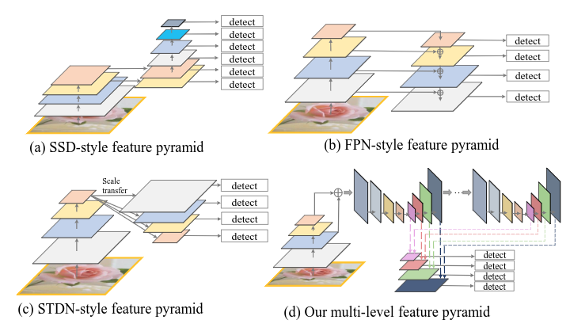
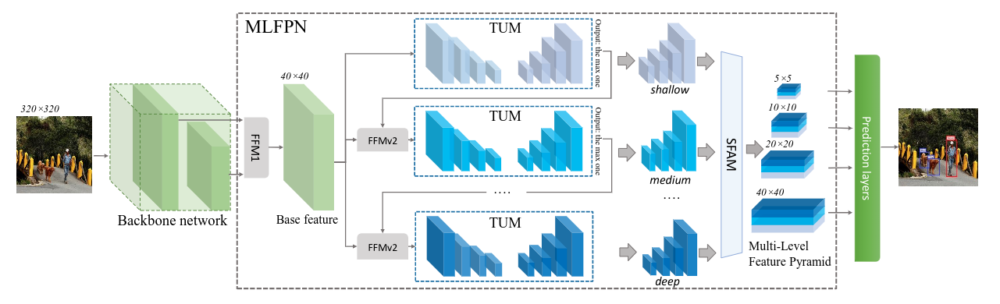
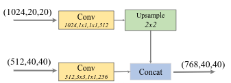
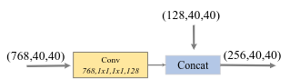
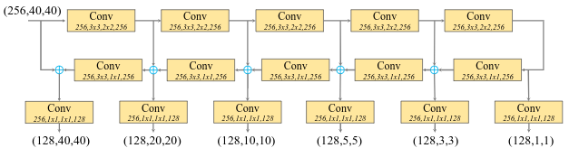
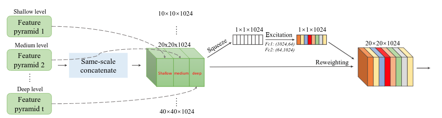
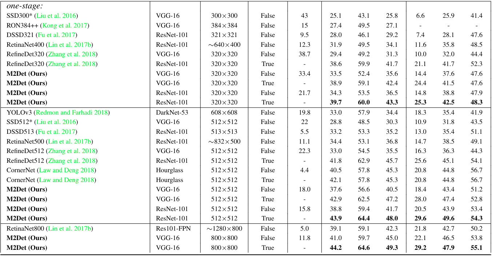

### M2Det: A Single-Shot Object Detector based on Multi-Level Feature Pyramid Network

1. 动机

   已有的几种特征金字塔:

   

   两点**局限性**:

   - 结构简单, 没有足够强的表达性
   - 特征金字塔中的feature map 来自backbone中较少个level的feature map, 使得这个feature map不能兼备分类和bounding box回归的任务

2. **方案**

   作者基于以上的动机设计了一个复杂的特征金字塔网络, 网络结构图:

   

   **FFM1** : 用于融合backbone不同尺度的特征度, 结构图为:

   ​	

   **FFM2** : 融合Base feature 和TUM的特征图，结构图为：

   ​	

   ​	(128, 40, 40) 的特征图来自于上一个TUM输出的最大尺度的feature map

   **TUM** : 就是一个FPN, 结构图为:

   ​	

   **SFAM** : 基于scale-wise的多个Feature Pyramid (产生于TUM)的融合, 结构图:

   ​	   

   ​	作者认为: The simple concatenation operations are not adaptive enough.

   ​	基于此作者引入了**通道的自注意力**(Channel-wise attention mechanism)机制**[1]**:

   ​		$ \rm { {\bf s} = F_{\mit ex}(z, W) = \sigma(W_2\delta(W_1z)) }$

   ​			$ \rm z \in \mathbb R^{\mit C}$表示特征图全局平均池化的统计量

   ​			$\rm W_1 \in \mathbb R^{\mit C\times \frac{C}{r}}$
   
   ​			$\rm W_2 \in \mathbb R^{\mit \frac{C}{r}\times C}$
   
   ​			$\delta$表示sigmoid函数,  $\sigma$表示ReLU函数
   
   ​		$\widetilde {X}_i^c = {\bf F}_{scale}({\bf X}_i^c, {\bf s}_c) = {\bf s}_c\cdot{\bf X}^c_i$
   
   ​			${\bf X}_i^c$表示原始的特征图
   
3. **结果**

   

[1]  Hu, J.; Shen, L.; and Sun, G. 2017. Squeeze-and-excitation networks. CoRRabs/1709.01507.

