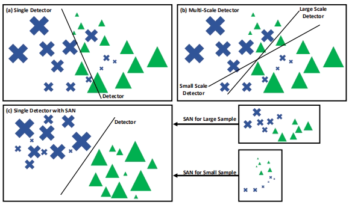
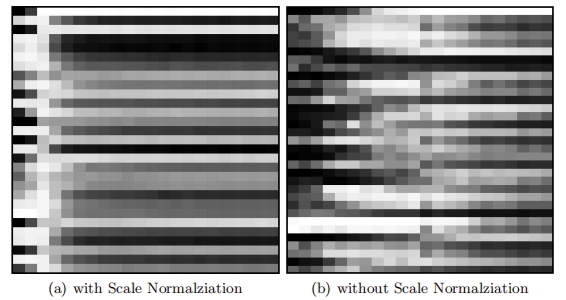
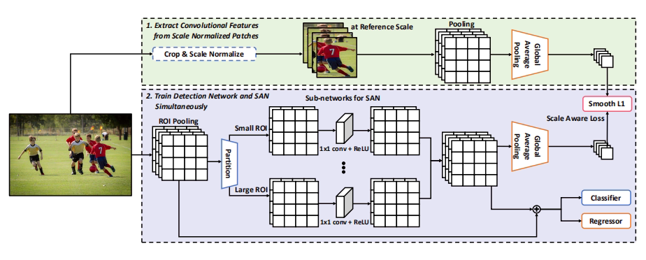
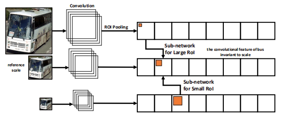
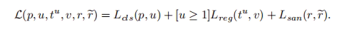
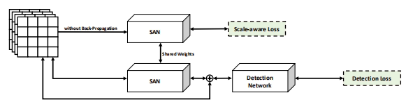

### SAN: Learning Relationship between Convolutional Features for Multi-Scale Object Detection

1. 动机: **基于CNN方法存在的尺度变化**

   - CNN-based detection method generally do not perform scale normalization.

   - 使用ROI Pooling或grid cells的CNN检测方法会对不同大小的ROI分别有不同的表达, 这种尺度变化会使模型提取完全不同的形状特征.

   - 单个检测器和多尺度检测器:

     

     - 单个检测器不考虑尺度空间
     - 多尺度检测器训练在多个尺度空间中分别训练检测器, 但在某个尺度空间的样例较少时, 会使分类器的学习变得困难

2. 方法:

   作者提出Scale aware Network: 将不同尺度的特征映射到一个尺度不变的公共子空间, 以此在这个子空间中训练一个检测器.

   - 为了探究Scale Normalziation的有效性, 定义Channel activation matrix(CAM)矩阵来表现不同尺度下通道被激活的情况, 如下图.

     

     

     图中的x轴表示尺度的从小到大, 纵轴表示不同通道的索引, 颜色的深浅表示该通道被激活的程度. 颜色越浅表示通道被激活的程度越大.
   
     从图中可以看出, 在进行Scale Normalziation后, 不同尺度对于通道的激活情况基本是一致的(尺度极小的情况下不成立). 而没有经过Scale Normalziation时, 通道的激活情况对于尺度的变化比较敏感, 不同尺度对通道的激活情况不一; 这印证了***动机***中的第二点.

   - Scale Aware Network Architecture:

     

     **SAN**将一个mini-batch中的ROIs分为三个尺寸: 对于VOC Pascal分为 $({0}^2, {160}^2]$,  $({160}^2, {288}^2]$,  $({288}^2, \infty]$, 对于MS COCO分为$({0}^2, {64}^2]$,  $({64}^2, {192}^2]$,  $({192}^2, \infty]$; 这些ROI经过SAN子网络, 再进行合并. 最后, 采用元素相加的模式合并原始特征, 进行分类和回归.

     每个SAN子网络由一个全卷积层和ReLU组成, 处理后通道数不变.

     **SAN网络学习经过Scale Normalziation 和 ROI Pooling的特征图的内部关系**, 使通道的激活对尺度的变化不敏感.

   - SAN的通道路由机制:

     不同尺度中不容的感受野会造成空间信息的混乱, 这种混乱会使SAN很难学习到期望的Scale Normalziation. 为了排除每个通道中的空间信息, 采用GAP(Global Average Pooling)学习通道信息.

     这种路由机制可表示为:

     

   - SAN网络的训练:

     采用Multi-task训练模式, 包括两个部分:
   
     - SAN + classification + Box regression
  - classification + Box regression

  loss function:

  

  learning trick:

  

   

   

   

   

   

   

   

   

   

   

   

   

   

   

   

   

   