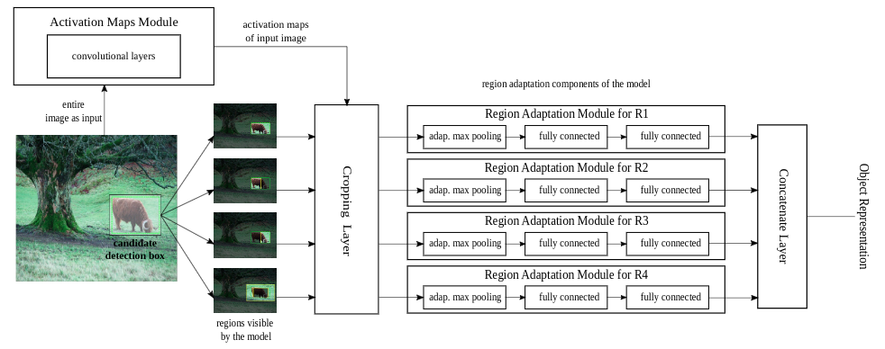
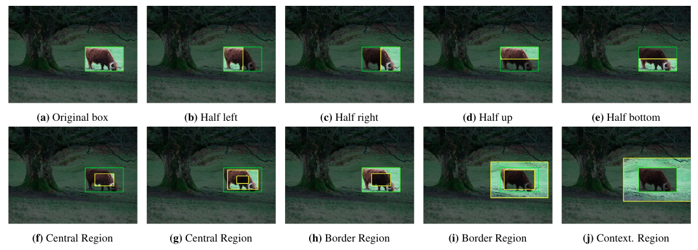
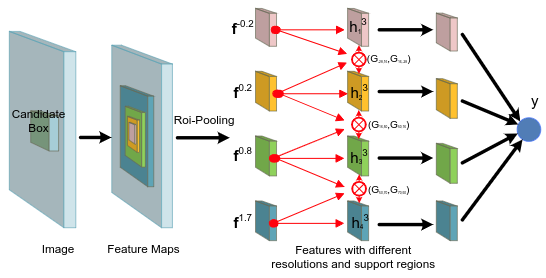
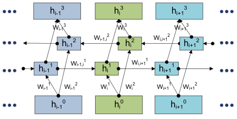
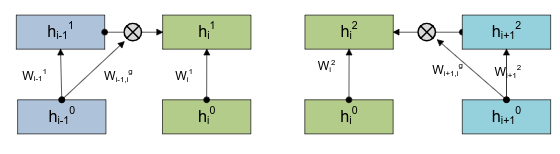
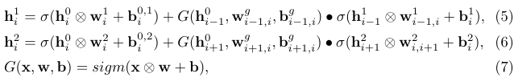

### 基于上下文的目标检测方法

`局部上下文特征`;`全局上下文特征`; `上下文交互`

- #### 使用局部上下文特征

  局部上下文(语境)信息指围绕在待检测目标周围的可视的上下文(语境)信息. 即是利用上目标周围的信息.

  - **MR-CNN[1]和MPNet[2]等采用multi-region的方式利用box周边的语境信息**.

    

    上图为MR-CNN的网络结构, 根据proposal box, 采样多个区域:

    

    MPNet采用类似的思想, 不过只采用了4个region.

  - **GBD-Net在使用多个Region的同时探究了不同region之间的关系**, 使用Gated Bi-diredtional的网络架构:

    

    集合$\bf f$表示对同一个proposal box进行不同程度缩放后经ROI Pooling后的集合, $ {\bf f}^{p}$ 中的$p$表示缩放率:

    原始proposal box: ${\bf b} = [x^o, y^o,w^o,h^o]$

    缩放取样的proposal box: ${\bf b}^p=[x^o,y^o,(1+p)w^o, (1+p)h^o]$

    **Gated Bi-directional network structure**:

    
  
    特别的, 对于$\rm h^1$和$\rm h^2$, 采用Gate function:
  
    
  
    
  
    $G$为Gate function
  
    

  

  

  

  

  

  

  

  

  
  
  
  
  
  
  
  
  
  
  

cpc