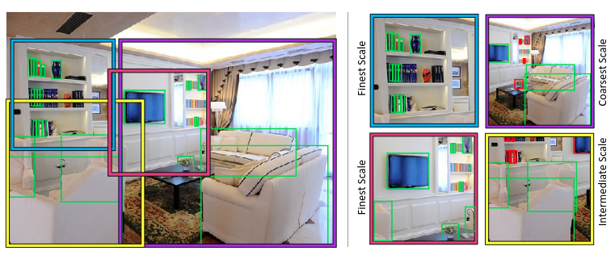
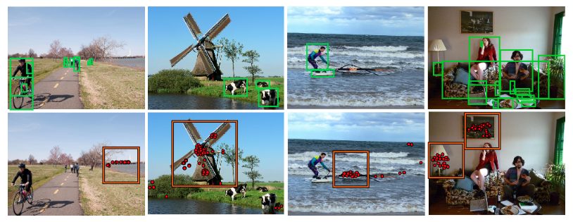

### 18_NIPS SNIPER: Efficient Multi-Scale Training

1. 动机

   作者针对SNIP抛出问题: 是否真的需要处理3个不同分辨率下的整张图片? 而且当图片分辨率较高时, object的尺寸已经足够大, 是否还有必要进行上采样?

   SNIP: 480 和 800 这两种分辨率往往会主导训练.

2. SNIPER 网络
   - 采样
     从3个尺度中进行采样, 在resize到512 * 512, 这样,  At extreme scales (like 3x), SNIPER observes less than one tenth of the original content present in the image.
     Since we are able to obtain similar performance by observing less than one tenth of the image, it implies that **very large context during training is not important for training high-performance detectors but sampling regions containing hard negatives is**.
     
     - 正chip采样
   
       对于某个尺度的图片, 采用滑动窗口产生chip, chip的大小为K*K,  步长为d. 在特定大小范围内的gt boxes为有效gt, 采用贪婪的模式选取chip, 以保证所该尺度下所有有效的gt都包含进来(每个有效的gt box都完整地出现在一个chip中) ; 
       
       另外, 对于chip包含一部分的有效gt则进行crop操作;
       
       
       
     - 负chip采样
     
       训练一个RPN网络: 用于选择可能包含的false positives. 首先从生成的proposal中去除已经被包含在正chip中的, 然后对于特定的尺度, 贪婪地选择包含至少M个特定大小范围proposal的负chip.
       
       
     
   - label Assignment
     
     每个chip产生300个proposal, 与gt boxes的overlap的阈值为0.5.
     
     对于每个chip, 其覆盖的所有gt boxes都会参与训练, 相反, **对于不在特定大小范围的proposal将被忽略**. 
     
     