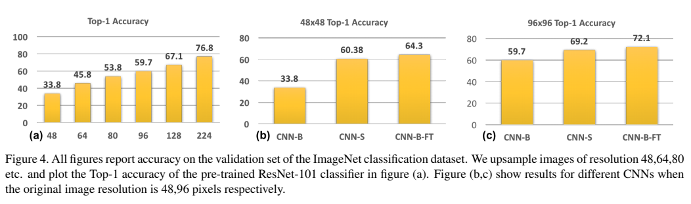
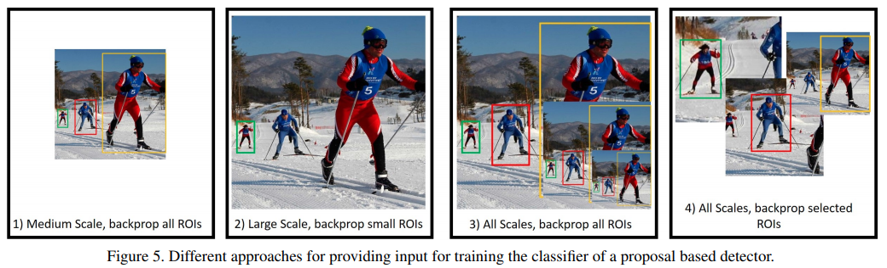
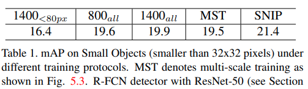
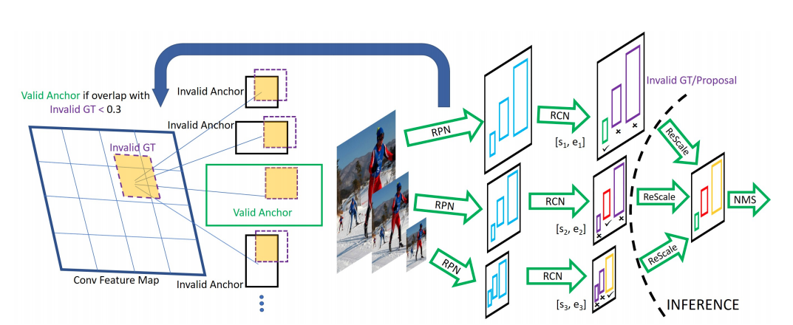

### 18-cvpr SNIP: An Analysis of Scale Invariance in Object Detection

1. 对COCO数据集的分析：

   

   相对于图像尺寸而言，COCO数据集目标尺寸分布不均匀，90%的目标尺寸小于图像尺寸的一半，且有一半的目标尺寸小于图像尺寸的10%. 相较之下，ImageNet的目标分布均匀，且集中于图像中央。

   从而用预训练参数的fune-tune时，由于这种目标大小分布差异，则就会出现domain-shift问题

2. 分类网络实验：

   1. CNN-B：Train on 224×224 original data，Test on up-sampled 48×48、64×64、80×80、96×96、128×128（to 224×224）separately；也就是高清图训练，低清图测试（虽然尺寸一样，但是清晰度不一样），看看“训练和测试尺度不一致会导致怎样的精度的差别”以及可以揭示domain shift问题的解决的重要性。似乎对于需要对于每个尺寸单独训一个分类器
   2. CNN-S：Train on 48×48，Test on 48×48；Train on 96×96，Test on 96×96。由于图像尺寸改变了，所以需要缩小网络开头的stride和kernel_size。由于测试和训练的尺寸一致，精度提升很多。
   3. CNN-B-FT：Train on 224×224 original data， fine-tune on up-sampled 48×48（to 224×224），test on up-sampled 48×48（to 224×224）；Train on 224×224 original data， fine-tune on up-sampled 96×96（to 224×224），test on up-sampled 96×96（to 224×224）。证明了“upsample small objects”然后训练是有利于对小物体的检测的，且在大物体224×224的预训练模型对于小物体48×48的训练是有帮助的。且比CNN-S精度高，所以无需scale specific detector。从而证明了SNIP的有效性。

   

3. 不同的方法
   - **使用不同分辨率训练**
     
     对不同分辨率的图片中所有的object进行训练。​问题：​会产生一些特别小或者特别大的Object，影响精度；
     
   - **特定尺度检测**
     对于一种分辨率，只训练其中特定尺度的object，而忽略其他尺度的物体；问题：需要多个分类器；
     
   - **多尺度训练** Multi-Scale Training（MST）
   
     与使用不同分辨率训练类似
   
     
   
     
4. SNIP网络（从MST改进而来）
   - 网络结构

     
     
     为了消除MST中extreme scale objects影响，SNIP放弃了不符合特定分辨率的ground truth boxes. 
     
     对于特定的分辨率i，if the area of ROI falls within a special range, it is marked as valid. 同样，与有效的gt box的overlap超过0.3的anchor用于回归训练; 在推理时, 使用RPN生成proposal boxes, 只有在同一 special range的box才被选择, 在分类和loc回归后, 使用soft-NMS混合所有分辨率的boxes, 得到最终的检测结果.
     
   - **training details**

     - Sampling Sub-Images

       generate the minimum number of chips (sub-images) of size 1000x1000 which cover all the small objects in the image.

     - training resolution and the special ranges

       Deformable-RFCN:

       (480, 800) : [120, MAX]

       (800, 1200) : [40, 160]

       (1400, 2000) : [0, 80]
